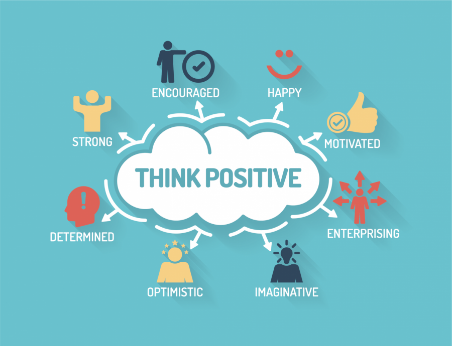
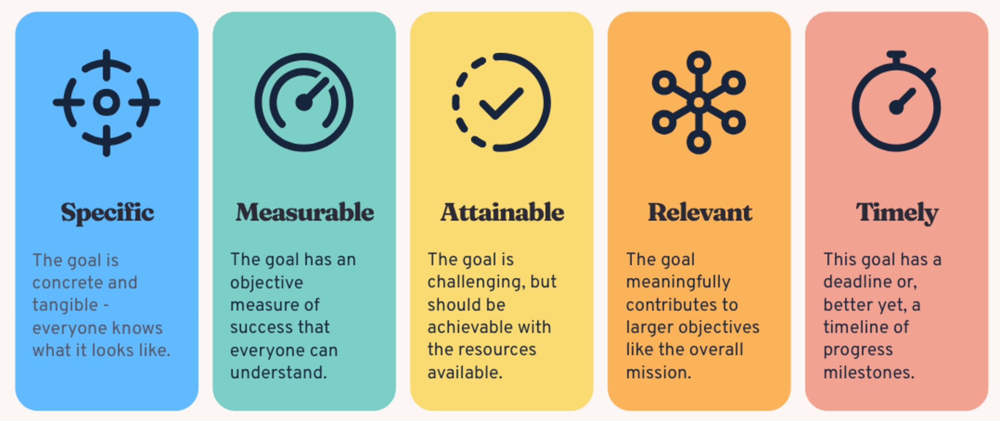
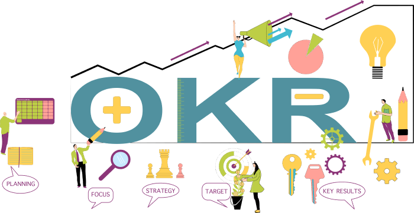
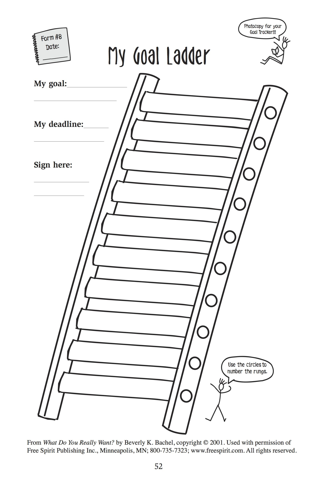
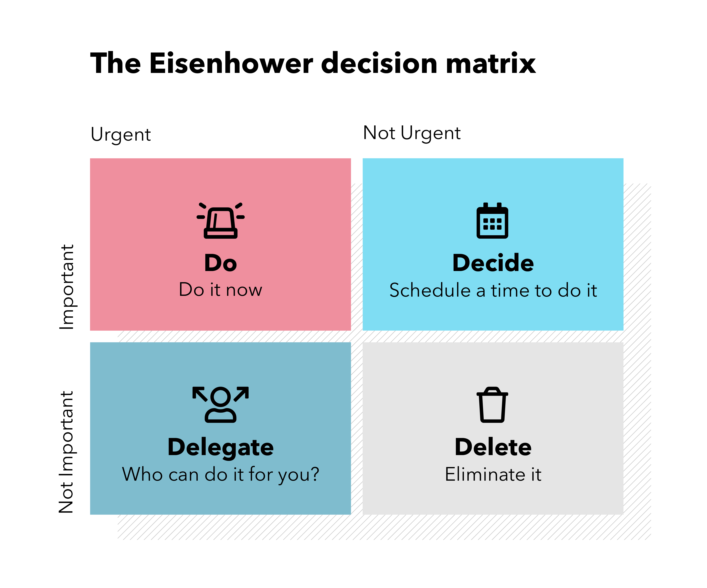
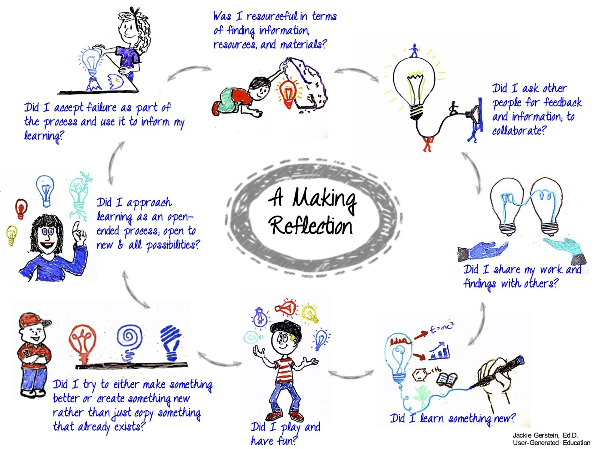

Chà, lại 1 năm nữa sắp đi qua, năm mới sắp đến. Ai rồi cũng phải đặt mục tiêu cho năm mới thôi. Hãy cùng KysuPM đi qua **7 bước đặt mục tiêu hiệu quả** cho bản thân nhé.

## Mục lục
- [1. Hình dung thành công](#1-hình-dung-thành-công)
- [2. Tạo mục tiêu smart](#2-tạo-mục-tiêu-smart)
- [3. Sử dụng OKRs](#3-sử-dụng-okrs)
- [4. Lập kế hoạch hành động](#4-lập-kế-hoạch-hành-động)
- [5. Đặt mốc thời gian](#5-đặt-mốc-thời-gian)
- [6. Duy trì tư duy phát triển](#6-duy-trì-tư-duy-phát-triển)
- [7. Phản ánh và điều chỉnh](#7-phản-ánh-và-điều-chỉnh)

## 1. Hình dung thành công

- Hãy tưởng tượng kết quả mong muốn của bạn như thể bạn đã đạt được chúng. 
- Sử dụng tất cả các giác quan để xây dựng động lực và sự tự tin

## 2. Tạo mục tiêu smart

- **Cụ thể:** xác định rõ ràng mục tiêu, không mơ hồ.
- **Đo lường được:** sử dụng các chỉ số để theo dõi tiến độ và thành công.
- **Có thể đạt được:** đặt mục tiêu thực tế trong khả năng và nguồn lực sẵn có của bạn.
- **Liên quan:** gắn mục tiêu với tầm nhìn tổng thể hoặc các mục tiêu của tổ chức.
- **Giới hạn thời gian:** đặt thời gian thực tế để giữ đúng tiến độ.

**Ví dụ:** tăng sự hài lòng của khách hàng lên 15% trong hai quý.

## 3. Sử dụng OKRs
OKRs là Mục tiêu và Kết quả then chốt. Chúng chia nhỏ các mục tiêu thành các đích đến và kết quả rõ ràng.

- **Mục tiêu:** tăng số lượng người theo dõi Tiktok từ 15K lên 20K trong quý 2.
- **Kết quả then chốt:** 
    - Đăng bài 3 bài / tuần 1 cách đều đặn
    - Đạt tỉ lệ tương tác 15%
    - Hợp tác với 5 người có ảnh hưởng

## 4. Lập kế hoạch hành động
- Chia nhỏ các mục tiêu lớn thành các bước nhỏ, dễ dàng hành động và theo dõi tiến độ.
- Sử dụng các công cụ như "thang mục tiêu" hoặc "ma trận Eisenhower" để lập kế hoạch các cột mốc nhỏ dẫn đến mục tiêu chính và xác định mục tiêu nào cần ưu tiên trước.

## 5. Đặt mốc thời gian

- Tạo lịch trình thực tế để duy trì sự tập trung và theo dõi tiến độ. Gợi ý sử dụng Google Calendar.
- Tính đến các cam kết khác để tránh đặt ra thời gian không thực tế

## 6. Duy trì tư duy phát triển

- Dự đoán các thách thức, rủi ro và lập kế hoạch đối phó, giải quyết.
- Tin tưởng vào bản thân và mục tiêu đã đề ra.
- Thiết lập các chế độ ăn uống, nghỉ ngơi hợp lý để tái tạo năng lượng.

## 7. Phản ánh và điều chỉnh

- Đánh giá tiến độ, xác định cái gì hiệu quả hoặc không, từ đó đưa ra điều chỉnh hợp lý.
- Tự đánh giá hoặc tham khảo ý kiến của những người xung quanh, họ sẽ là nguồn hữu ích chỉ ra những thiếu sót, điểm mù mà bản thân không nhìn thấy được.

**Ví dụ:** Theo dõi doanh thu hàng tháng: $80K từ nội dung tự nhiên, $20K từ quảng cáo --> điều chỉnh ngân sách sang nội dung tự nhiên và giảm chi tiêu cho quảng cáo.

Với 7 bước cơ bản, bạn có thể tự thiết lập cho mình những mục tiêu rõ ràng và có thể đạt được trong năm mới. Hãy chia sẻ nếu như bạn có những phương pháp nào hữu ích nhé.