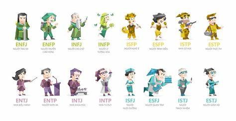
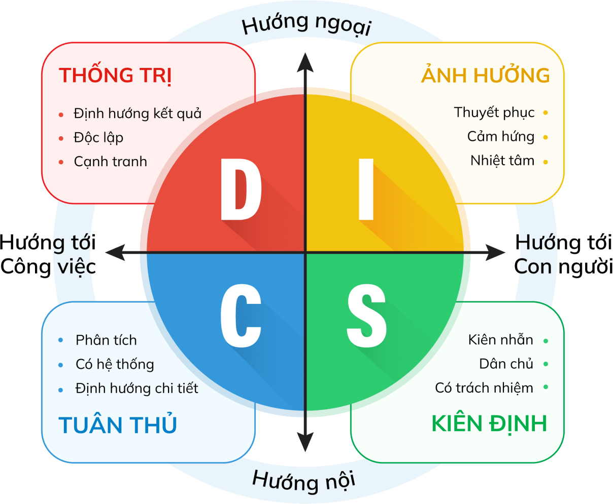
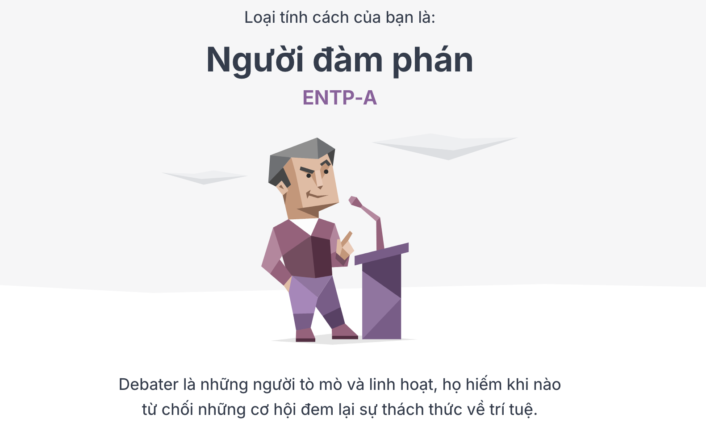

Hồi này tui rảnh nên hay lướt net để đọc báo, xem Youtube. Gần đây cứ hay bị nghiện các kênh về phát triển bản thân, tư duy ngược, đọc sách, ... rồi các suy nghĩ làm thế nào để phát triển bản thân tốt hơn.

Cũng lớ ngỡ nghĩ sao mấy ông YTber giỏi thế, sáng tạo hay mà làm video cũng hấp dẫn, cũng thử nghĩ xem làm thế nào để mình cũng có thể làm được nội dung như vậy. Nghĩ thế thôi chứ chưa biết phải làm thế nào cả.

Ngồi 1 hồi thì chợt nhớ lại hồi ở cty cũ có được đào tạo và cho làm trắc nghiệm tính cách để có thể đánh giá được mình thuộc loại tính cách nào và phù hợp với các công việc, vị trí gì.

Nhờ ChatGPT tìm hộ vài website uy tín để khám phá lại bản thân và nghề nghiệp :D.

1. [16Personalities](16personalities.com): Trang web này cung cấp bài kiểm tra tính cách MBTI miễn phí và dễ hiểu, giúp bạn tìm hiểu kiểu tính cách của mình, cũng như những điểm mạnh, điểm yếu, và gợi ý nghề nghiệp phù hợp.

2. [MBTI Việt Nam](mbti.vn): Nền tảng này tập trung vào trắc nghiệm MBTI với giao diện tiếng Việt, phân tích chuyên sâu về từng nhóm tính cách và các ứng dụng trong công việc và cuộc sống.

3. [JobTest](jobtest.vn): Cung cấp nhiều bài kiểm tra tính cách và năng lực khác nhau, bao gồm MBTI, DISC, Big Five và EQ. Trang này rất hữu ích nếu bạn đang tìm kiếm định hướng nghề nghiệp hoặc đánh giá năng lực bản thân.

4. [Trắc nghiệm DISC](discpersonalitytesting.com): Chuyên về DISC, bài kiểm tra này giúp bạn hiểu về cách bạn giao tiếp và làm việc nhóm, phù hợp cho việc phát triển kỹ năng giao tiếp và lãnh đạo.

Nói thêm là việc làm trắc nghiệm này không đúng hoàn toàn về bản thân nhưng mà nó cũng là cơ sở để tự chiêm nghiệm lại về bản thân và tìm kiếm lại sự hứng khởi trong công việc và cuộc sống.

Zô thôi, tui rảnh nên tui thử 2 loại trắc nghiệm **MBTI** và **DISC** luôn.

- **MBTI** là công cụ đánh giá tính cách của Myers-Briggs, dựa trên bốn cặp đối lập
    - Hướng ngoại - Hướng nội (E-I)
    - Giác quan - Trực giác (S-N)
    - Lý trí - Cảm xúc (T-F)
    - Nguyên tắc - Linh hoạt (J-P)

==> Tạo ra 16 nhóm tính cách khác nhau với nhưng ưu và nhược điểm riêng biệt.

- **DISC**: là một loại trắc nghiệm dùng để đánh giá hành vi cá nhân tập trung vào bốn đặc điểm tính cách nổi bật con người trong một khoảng thời gian nhất định
    - Dominance - Sự thống trị (D)
    – Influence - Ảnh hưởng (I)
    – Steadiness - Kiên định (S)
    – Compliance - Tuân thủ (C)

Xin mời các bạn xem kết quả của tui.

### MBTI:
Người đàm phán [ENTP-A](https://www.16personalities.com/vi/lo%E1%BA%A1i-t%C3%ADnh-c%C3%A1ch-entp)

Các bạn nghĩ sao về kết quả trên, còn bạn đã thử làm trắc nghiệm chưa? Thấy có phù hợp với bản thân không? Hãy share để mình cùng thảo luận.
