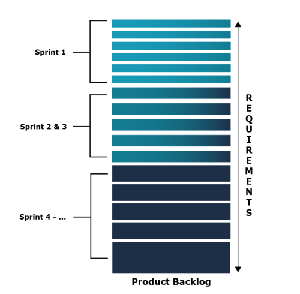

The Product Backlog’s purpose is to represent all of the work the Scrum Team knows it needs to do in order to deliver the product. Teams can use the Product Backlog to make decisions about what they should do next. 

The Product Backlog consists of:

Product Backlog items (PBIs) - each of which represents something that needs to be done. 
A Product Goal - that describes the Scrum Team’s current long-term objective for the product.
Product Backlogs are a single, transparent way to find the Scrum Team’s current knowledge of all work that must be done. They are kept as an ordered list.

Single: There should be only one Product Backlog per product. This means that there are no separate backlogs for different types of PBIs, for example no backlog for defect reports or for UX work. Everything lives in the same Product Backlog. Additionally, if multiple Scrum Teams are working on the same product, they use the same backlog.
Transparent: it should be easily accessible and used to drive a shared understanding of the PBIs among the Scrum Team and stakeholders.
Current: The Product Backlog is “emergent” meaning that it grows, shrinks and evolves over time. It is not a static artifact, it is updated frequently based on information uncovered during development as well as from stakeholders, customers and the market.
Ordered: The order of the PBIs is decided by the Product Owner. The order may be based on factors such as business value, risk, return on investment or dependencies.

----
Mục đích của Product Backlog là thể hiện tất cả công việc mà Nhóm Scrum biết họ cần làm để phân phối sản phẩm. Các nhóm có thể sử dụng Product Backlog để đưa ra quyết định về những gì họ nên làm tiếp theo. 

Product Backlog bao gồm:

- Các hạng mục tồn đọng của sản phẩm (PBI) - mỗi hạng mục đại diện cho một việc gì đó cần được thực hiện. 
- Mục tiêu sản phẩm - mô tả mục tiêu dài hạn hiện tại của Nhóm Scrum đối với sản phẩm.

Product Backlog là một cách minh bạch, duy nhất để tìm hiểu kiến ​​thức hiện tại của Nhóm Scrum về tất cả công việc phải hoàn thành. Chúng được lưu giữ như một danh sách có thứ tự.

- Đơn lẻ: Chỉ nên có một Product Backlog cho mỗi sản phẩm. Điều này có nghĩa là không có tồn đọng riêng biệt cho các loại PBI khác nhau, chẳng hạn như không có tồn đọng cho các báo cáo lỗi hoặc cho công việc UX. Mọi thứ đều tồn tại trong cùng một Product Backlog. Ngoài ra, nếu nhiều Nhóm Scrum đang làm việc trên cùng một sản phẩm thì họ sẽ sử dụng cùng một hồ sơ tồn đọng.
- Minh bạch: nó phải dễ dàng truy cập và sử dụng để thúc đẩy sự hiểu biết chung về PBI giữa Nhóm Scrum và các bên liên quan.
- Hiện tại: Product Backlog “nổi lên” nghĩa là nó phát triển, thu hẹp và phát triển theo thời gian. Nó không phải là một tạo phẩm tĩnh, nó được cập nhật thường xuyên dựa trên thông tin được phát hiện trong quá trình phát triển cũng như từ các bên liên quan, khách hàng và thị trường.
- Đã đặt hàng: Thứ tự của PBI do Chủ sở hữu sản phẩm quyết định. Thứ tự có thể dựa trên các yếu tố như giá trị kinh doanh, rủi ro, lợi tức đầu tư hoặc sự phụ thuộc.

[Nguồn scrum.org](https://www.scrum.org/learning-series/product-backlog/introduction-to-the-product-backlog)
